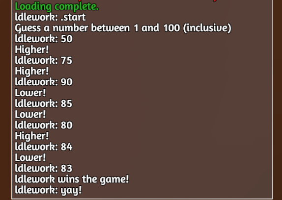

**VATTS IS ALPHA SOFTWARE**


# VATTS
VSCode and Tabletop Simulator

Vatts is an extension for VSCode to help with Tabletop Simulator mod development:

- Send scripts to Lua
- Bundle multiple Lua files as one
- Transpile Typescript to Lua

Vatts can be installed ~~from the VSCode Extension Marketplace or~~ as a `.VSIX` downloaded from our releases page:

https://github.com/dustinlacewell/vatts/releases

# Installation

Vatts is an extension for [VScode](https://code.visualstudio.com/).

## ~~Installing from the Marketplace~~

- ~~Use the VScode command-palette (`ctrl-shift-p`)~~
- ~~Access `Extensions: Install Extensions`~~
- ~~Search for `Vatts`~~

## Installing from VSIX Release

- Download a VSIX from our [releases page](https://github.com/dustinlacewell/vatts/releases)
- Use the VSCode command-palette (`ctrl-shift-p`)
- Access `Extensions: Install from VSIX...`
- Select the VSIX file

## Building from Source

The primary requirement for building Vatts is [NodeJS](https://nodejs.org/en/).

From the repository `vatts/vatts/` directory:

    $ npm install # install dependencies

Then package the VSIX:

    $ node node_modules/vsce/out/vsce publish

# Overview

Vatts is an alternative to the official Atom plugin, for VSCode. If you haven't heard, [Ben Dobel got the VSCode Moonsharp debugger working against TTS](https://github.com/tts-community/moonsharp). This means that with VSCode we can step-debug our TTS mods. The value of the step-debugger over `print()` statement debugging can't be understated! But using both VSCode and Atom for different parts of the mod process sucks!

Hence, Vatts.

## TTS Integration

Vatts can do many of the things the official Atom plugin can do:

- Send global and object scripts ~~and XML~~ to TTS
- Display chat and error messages in the editor
- Jump to the line where an error occurs
- Evaluate selection or buffer as Lua

It can also do some new things:

- Send selection or buffer as JSON
- ~~Send text directly to chat~~

It also *can't* do some old things (yet?):

- Highlight objects in TTS when mousing over GUIDs

## Lua Bundler

Each TTS game and object can have only a single associated Lua script file. This makes it cumbersome to organize larger mods with more code. Vatts' Lua bundler will allow you to keep your code in multiple files and use `require()` to import one module into another. Vatts recursively searches your code for these require calls to bring all the code into a single file Lua bundle. This bundle can then be sent to TTS or uploaded to the Workshop as normal.

~~Vatts also implements the same XML include functionality from the Atom plugin.~~

### Source-mapped "jump to error"

When TTS reports an error in your mod, it reports the line within the bundle where the error ocurred. Vatts can jump to the corresponding line in the original Lua file making for a nicer debugging experience.

## Typescript Transpiler

Lua is an OK language and its users love it. However, there are serious advantages (and downsides) to a language like Typescript. Vatts can take your Typescript code and translate it to the (nearly) equivalent Lua code. This Lua code can then be sent to TTS like normal.

### Serious Advantages?

Typescript is a modern language that usually translates to Javascript. Javascript and Lua have a lot in common! The primary way is probably that they both revolve around their table type. However, Javascript and Lua are both dynamically typed. This means that you have to run the program before any errors in the program can be discovered.

Statically typed languages, like Typescript, allow you to specify the types of your variables and function parameters. The advantage is that if you ever use a variable the wrong way, or pass the wrong kind of variable to a function, you'll know about it as you're typing the mistake.

Additionally, if the editor knows the types of your variables then it can help you access their properties or methods with powerful Intellisense capabilities. Typing information can even be provided for the standard Lua libraries and the TTS API itself.

Typescript has many other modern language features which you can explore using its documentation:

https://www.typescriptlang.org/docs/home.html


## Resuable source libraries

Whether developing in Lua or Typescript, Vatts makes authoring and utilizing libraries a realistic option. Got a bunch of helpful TTS utilty functions? Now if you publish them as a library, people using Vatts might be able to put it to use without much pain thanks to the support for `require()` in Lua, and Typescript's import system.

# User guide

In this user guide, we'll walk through making a simple mod for Tabletop. We will leave Vatts unconfigured as it can be used out of the box.

Vatts has three major components which form a pipeline:

    [Typescript Transpiler] => [Lua Bundler] => [TTS Integration]

If you only use Lua, don't worry! Any component can be used independently. To demonstrate, this guide will build the mod in reverse order:

- Using the basic TTS integration to send a single-file mod to TTS
- Breaking up the mod into multiple files and using the Lua Bundler to put them back together
- Finally porting the mod to Typescript and seeing the full pipeline at work

## Vatts Project Layout

To begin, create a folder for the mod and open it within VSCode. This will be the workspace root.

There are three primary directories that are important to Vatts:

- `ttslua/$GUID.ttslua` global and object scripts sent to TTS
- `lua/$GUID/index.lua` where multi-file global and object mods are bundled from
- `ts/$GUID.ts` where typescript global and object mods are transpiled from

These are just the default locations. Check the configuration reference for options to change them. In each case the `$GUID` refers to an actual TTS GUID, with `global` corresponding to the global script.

When Vatts bundles a multi-file Lua mod such as `lua/global/index.lua`, by default, it will place the bundle at `ttslua/global.ttslua` - exactly where it needs to be to send to TTS. Similarly, when Vatts compiles a Typescript mod such as `ts/global.ts`, by default, it will place the resulting lua files into `lua/global/` - exactly where they need to be to be bundled.

As you can see the output from one step, is the input to the other, with the final destination being TTS (or the Workshop). The rest of this guide will demonstrate how this happens in more detail.

## Vatts Commands

The ~~main~~ only way to interact with Vatts (at the moment) is through VSCode command-palette commands. There are three primary operations Vatts can do:

- Update TTS with mod scripts ~~and XML~~
- Bundle multi-file Lua mods
- Transpile Typescript mods

Often one will want to perform any of these actions in sequence so Vatts offers commands composing all of the combinations:

- `VATTS: Compile, Bundle and Update`
- `VATTS: Bundle and Update`
- `VATTS: Update`

## Example Sources

Each of the following examples are available from the `examples/` directory of Vatts' git repository. You can open each in VSCode and perform the builds with Vatts, or you can make your own projects and follow along by typing out the examples yourself.

## Single-file Global Script

To begin, create a `ttslua` folder within your workspace. This is where your TTS scripts will live. When you execute the palette command `VATTS: Update` each mod configured in `vatts.tts.game-scripts` will be sent to TTS. By default, `ttslua/global.ttslua` is configured as the global mod.

Our mod will implement a "guess the number" game. Copy the following to `ttslua/global.ttslua` and save:

```lua
function onChat(message, sender)
    local name = sender.steam_name
    local reply = name .. " said: " .. message
    print(reply)
end
```

After we `VATTS: Update` we can type into the TTS chat to see our message echoed back to us:


The reply is being sent on the very same frame and can be seen ahead of the actual message. Let's delay handling of chat messages until the next frame:

```lua
function handleMessage(message, sender)
    local name = sender.steam_name
    local reply = name .. " said: " .. message
    print(reply)
end

function onChat(message, sender)
    Wait.frames(function() handleMessage(message, sender) end, 1)
end
```

Now the reply is sent at the correct time:


#### Object Scripts

Even though we wont use any object scripts in this example mod - they work the same way as the Global script. Add additional entries to `vatts.tts.game-scripts` for any additional object scripts you need.

### Simple Version

Now that we can send scripts to TTS, let's start with a simple version of our game:

```lua
-- some variables to hold game state
local target = nil
local lower = 1
local upper = 100

function handleMessage(message, sender)
    if message == ".start" then
        target = math.random(lower, upper)
        print("Guess a number between " .. lower .. " and " .. upper .. " (inclusive)")
        return
    end

    local guess = tonumber(message)

    if target ~= nil and guess ~= nil then
        if guess < target then
            print("Higher!")
        elseif guess > target then
            print("Lower!")
        else
            print(sender.steam_name .. " wins the game!")
            target = nil
        end
    end
end

function onChat(message, sender)
    Wait.frames(function() handleMessage(message, sender) end, 1)
end
```

After updating the game we can test it out. Notice that it correctly ignores input once the game is over:




### Advanced Version

Now let's go ahead and complicate things by adding a bunch of features.

#### Command Parsing

Let's add a few functions to handle any kind of chat commands we'd like:

```lua
-- functions to parse commands
function parseArgs(text)
    -- return an array of `text` split on whitespace
    local args = {}

    for arg in string.gmatch(text, "%S+") do
      table.insert(args, arg)
    end

    return args
end

function parseMessage(message)
    -- get the command and any args from `message`
    local command = string.match(message, "^%.(%w+)")

    if command == nil then
        return
    end

    local args = string.match(message, "^%.%w+%s+(.+)")

    if args ~= nil then
        args = parseArgs(args)
    end

    return command, args
end

function handlerForCommand(command)
    -- lookup handler for `command` from global namespace
    local command_name = string.gsub(command, "^%a", string.upper)
    return _G["do" .. command_name]
end

function handleMessage(message, sender, default_handler)
    -- call function named do$FOO(sender, $ARGS) where $FOO and $ARGS are extracted from `message`
    local command, args = parseMessage(message)

    if command == nil then
        default_handler(message, sender)
        return
    end

    local handler = handlerForCommand(command)

    if handler == nil then
        default_handler(message, sender)
        return
    end

    if args then
        handler(sender, table.unpack(args))
    else
        handler(sender)
    end
end
```

`parseArgs` splits a string `text` on whitespace returning an array of substrings. `parseMessage` uses this to extract the arguments from its `message` argument. It does that after first extracting the command which must appear at the start of `message` prefixed with a `.` period.

`handleMessage` calls `parseMessage` to get the command and args. It then calls `handlerForCommand` which looks for a function with same name as the command but prefixed with `do`. So the command `.foobar` would find the function `doFoobar`. Now we can just define functions with the right name to handle chat commands!

Here's an example which echos the arguments back to chat:

```lua
function doEcho(sender, ...)
    local message = table.concat(table.pack(...), " ")
    print(sender.steam_name .. " said: " .. message)
end
```


#### Game Logic

Next, let's create some functions for controlling the game:

```lua
-- functions for game logic
function start(who, new_lower, new_upper)
    upper = new_upper or 100
    lower = new_lower or 1
    target = math.random(lower, upper)
    print("Guess a number between " .. lower .. " and " .. upper .. " (inclusive!)")
end

function finish(who)
    print(who.steam_name .. " won the game!")
    target = nil
end

function terminate(who)
    print(who.steam_name .. " terminated the game :(")
    target = nil
end

function handleGuess(message, sender)
    -- ignore messages when there's no active game
    if target == nil then
        return
    end

    -- check `message` as `guess` against `target`
    local guess = tonumber(message)

    -- ignore non-numeric messages
    if guess == nil then
        return
    end

    -- respond to the player
    if guess == target then
        finish(sender)
    elseif guess < target then
        print("Higher!")
    else
        print("Lower!")
    end
end
```

Now we have a function to `start` and `finish` and a way to `terminate` the game early. `handleGuess` will handle player guesses. Notice that `start` allows the player to change the guessing range.

Now we need to update our `onChat` handler to use `handleGuess` as our default handler:

```lua
function onChat(message, sender)
    -- so our response always appears after the chat we're responding to
    Wait.frames(function() handleMessage(message, sender, handleGuess) end, 1)
end
```

#### Command Handlers

Finally, we need some command handlers to start and end the game:

```lua
-- command handlers
function doEnd(who)
    if target then
        terminate(who)
    end
end

function doStart(who, lower, upper)
    if target == nil then
        start(who, lower, upper)
    end
end
```

These functions add two commands `.start` and `.end` which start and end the game respectively.

#### Putting it all together

The final script should look something like this:

```lua
number = nil
lower = 0
upper = 100


-- functions to parse commands
function parseArgs(text)
    -- return an array of `text` split on whitespace
    local args = {}

    for arg in string.gmatch(text, "%S+") do
      table.insert(args, arg)
    end

    return args
end

function parseMessage(message)
    -- get the command and any args from `message`
    local command = string.match(message, "^%.(%w+)")

    if command == nil then
        return
    end

    local args = string.match(message, "^%.%w+%s+(.+)")

    if args ~= nil then
        args = parseArgs(args)
    end

    return command, args
end

function handlerForCommand(command)
    -- lookup handler for `command` from global namespace
    local command_name = string.gsub(command, "^%a", string.upper)
    return _G["do" .. command_name]
end

function handleMessage(message, sender, default_handler)
    -- call function named do$FOO(sender, $ARGS) where $FOO and $ARGS are extracted from `message`
    local command, args = parseMessage(message)

    if command == nil then
        default_handler(message, sender)
        return
    end

    local handler = handlerForCommand(command)

    if handler == nil then
        default_handler(message, sender)
        return
    end

    if args then
        handler(sender, table.unpack(args))
    else
        handler(sender)
    end
end

-- functions for game logic
function start(who, new_lower, new_upper)
    upper = new_upper or 100
    lower = new_lower or 1
    target = math.random(lower, upper)
    print("Guess a number between " .. lower .. " and " .. upper .. " (inclusive!)")
end

function finish(who)
    print(who.steam_name .. " won the game!")
    target = nil
end

function terminate(who)
    print(who.steam_name .. " terminated the game :(")
    target = nil
end

function handleGuess(message, sender)
    -- ignore messages when there's no active game
    if target == nil then
        return
    end

    -- check `message` as `guess` against `target`
    local guess = tonumber(message)

    -- ignore non-numeric messages
    if guess == nil then
        return
    end

    -- respond to the player
    if guess == target then
        finish(sender)
    elseif guess < target then
        print("Higher!")
    else
        print("Lower!")
    end
end

-- command handlers
function doEnd(who)
    if target then
        terminate(who)
    end
end

function doStart(who, lower, upper)
    if target == nil then
        start(who, lower, upper)
    end
end

-- actual TTS event handler
function onChat(message, sender)
    -- so our response always appears after the chat we're responding to
    Wait.frames(function() handleMessage(message, sender, handleGuess) end, 1)
end
```

An example play:


## Lua Bundling

Now that we have a firm grasp on how to use Vatts to send Lua scripts to TTS let's see how we can use its Lua Bundler to break up script into smaller files.

By default all Lua files for the Global script will go into the `lua/global/` directory of our workspace. Go ahead and create that directory now. We'll go over each new file one at a time.

### lua/global/commands.lua

In this file we'll place our code for handling commands:

```lua
local commands = {}

-- functions to parse commands
function commands.parseArgs(text)
    -- return an array of `text` split on whitespace
    local args = {}

    for arg in string.gmatch(text, "%S+") do
      table.insert(args, arg)
    end

    return args
end

function commands.parseMessage(message)
    -- get the command and any args from `message`
    local command = string.match(message, "^.(%w+)")

    if command == nil then
        return
    end

    local args = string.match(message, "^.%w+%s+(.+)")

    if args ~= nil then
        args = commands.parseArgs(args)
    end

    return command, args
end

function commands.handlerForCommand(command)
    -- lookup handler for `command` from global namespace
    local command_name = string.gsub(command, "^%a", string.upper)
    return _G["do" .. command_name]
end

function commands.handleMessage(message, sender, default_handler)
    -- call function based on command with sender and args extracted from `message`
    local command, args = commands.parseMessage(message)

    if command == nil then
        default_handler(message, sender)
        return
    end

    local handler = commands.handlerForCommand(command)

    if handler == nil then
        default_handler(message, sender)
        return
    end

    if args then
        handler(sender, table.unpack(args))
    else
        handler(sender)
    end
end

return commands
```

The code is mostly the same as before but this time we format the source file as a Lua module. At the top, we declare a table called `commands` which is the same name as our file. The last line in the file returns this table. Lastly, each of the function names has been adjusted so they are declared on the `commands` table. When `handleMessage` calls `parseMessage` it ensures it accesses the function from the table as `commands.parseMessage`. Same when `parseMessage` calls `parseArgs`.

### lua/global/logic.lua

The same changes to make `commands.lua` into a proper Lua module have been made to `logic.lua` as well:

```lua
local logic = {}

-- functions for game logic
function logic.start(who, new_lower, new_upper)
    upper = new_upper or 100
    lower = new_lower or 1
    target = math.random(lower, upper)
    print("Guess a number between " .. lower .. " and " .. upper .. " (inclusive!)")
end

function logic.finish(who)
    print(who.steam_name .. " won the game!")
    target = nil
end

function logic.terminate(who)
    print(who.steam_name .. " terminated the game :(")
    target = nil
end

function logic.handleGuess(message, sender)
    -- ignore messages when there's no active game
    if target == nil then
        return
    end

    -- check `message` as `guess` against `target`
    local guess = tonumber(message)

    -- ignore non-numeric messages
    if guess == nil then
        return
    end

    -- respond to the player
    if guess == target then
        logic.finish(sender)
    elseif guess < target then
        print("Higher!")
    else
        print("Lower!")
    end
end

return logic
```

### lua/global/index.lua

Finally, the index module contains the code that "starts" our mod. The name isn't optional and is the entrypoint for every Lua bundle.

```lua
local commands = require("./commands")
local logic = require("./logic")

-- command handlers
function doEnd(who)
    if target then
        logic.terminate(who)
    end
end

function doStart(who, lower, upper)
    if target == nil then
        logic.start(who, lower, upper)
    end
end

-- actual TTS event handler
function onChat(message, sender)
    -- so our response always appears after the chat we're responding to
    Wait.frames(function() commands.handleMessage(message, sender, logic.handleGuess) end, 1)
end
```

Notice that `index.lua` utilizes the `require()` function to import the other two modules. Anytime it references functions from those modules it does so via the local variables, such as when `commands.handleMessage` is called or `logic.doGuess` is referenced.

### Running the Bundler

Even though it is much more convinent to keep our mod in multiple Lua modules, Tabletop can only accept a single Lua script per GUID. Ouch! Vatts' Lua Bundler can take our Lua modules and combine them back into a single file that we can send over.

When we execute the `TTS: Bundle` or `TTS: Bundle (Debug)` palette commands, Vatts will bundle our `lua/global/index.lua` file and all the related files into `ttslua/global.ttslua`. This is exactly where we need it to be in order to send it to TTS with the `TTS: Update` command. In fact, Vatts will bundle every sub-directory within `lua/` this way. This means you can organize your Object scripts this way too.

As a convinence, the `TTS: Bundle and Update` command will perform both commands in sequence!

### Sharing Code

Let's say you were building a Global bundle and an Object bundle. You want them both to respond to chat commands like we do in the number guessing game. But you don't want to duplicate the code between the bundles. Instead you can move the code outside of the bundles to anywhere within your VSCode workspace.

Once you've moved the shared code, simply update any relevant `require()` calls so that the paths reflect the new location. Unfortunately you cannot currently `require()` code outside of your VSCode workspace. To share code across projects, you will need to utilize symlinks. If your project uses npm, you can "npm install ../../../some/path" and then do something like `require("../node_modules/yourlib/)`.

**Notice**: All `require()` paths are relative from the bundle root. (where the `index.lua` file goes, eg `lua/global/`)

## Using Typescript

Typescript has the potential to speed up mod development by saving us from numerous issues long before our code is sent to TTS. Often we will be warned of mistakes right as we are typing them. Let's port our mod to Typescript!

All Typescript code will live inside the `src/` folder within our workspace so go ahead and create it.

### Type Definitions

Typescript understands the code you write and can check it for various errors. However, Typescript doesn't know anything about standard Lua modules, or the Tabletop Simulator API. To tell Typescript about them, we can put `index.d.ts` files within folders inside the `node_modules/@types` folder within our workspace.

Go ahead and create `node_modules/@types/lua/index.d.ts` with the following content:

```typescript
declare const _G: { [key: string]: any}

declare function print(...parts: any[]): void

declare function tonumber(text: string): number

declare namespace string {

    /** @tupleReturn */
    export function match(s: string, pattern: string, init?: number): string[] | null;

    /** @tupleReturn @luaIterator */
    export function gmatch(s: string, pattern: string): Iterable<string[]>

}

declare namespace math {
    export function random(lower: number, upper: number): number;
}

declare class Wait {
    static frames(handler: any, frames: number): void;
}
```
This tells the Typescript compiler about all the functions and namespaces from the Lua runtime that we'll be using. If we didn't add these, Typescript compiler would warn us we were calling undefined functions and the like.

### src/commands.ts

To warm up let's start with porting the `parseArgs`:

```typescript
export function parseArgs(text: string): string[] {
    const args = [];
    for (const [arg] of string.gmatch(text, "%S+")) {
        args.push(arg);
    }
    return args;
}
```

This function splits `text` by whitespace and then drains the iterator returned by `gmatch` by filling the `string[]` named `args` which is returned.

*Note: that `gmatch` returns an iterator of `string[]` containing a string for each capture group in the pattern. Since there is only one pattern in `"%S+"`, we can get the single match out by destructuring.*

Next we have the `parseMessage` function:

```typescript
export function parseMessage(message: string): [string, string[]] {
    const [command] = string.match(message, "^%.(%w+)");

    if (command == null) {
        return;
    }

    let args = [];
    let [argstr] = string.match(message, "^%.%w+%s+(.+)");

    if (args) {
        args = parseArgs(argstr);
    }
    return [command, args]
}
```

This function is very similar to the Lua version. However in this version we cannot reuse the `args` variable to contain first the `string` and then the `string[]` since those are different types. Typescript makes sure each variable only ever has one type. So instead we save the `string` to `argstr` and the `string[]` to `args`.

The `handlerForCommand` function is slightly different in how it capitalizes the first letter of the command but other than that replciates the action of the Lua version:

```typescript
export function handlerForCommand(command: string) {
    const command_name = command[0].toUpperCase() + command.slice(1);
    const handler_name = `do${command_name}`;
    return _G[handler_name];
}
```

Finally the `handleMessage` function which is nearly identical:

```typescript
export function handleMessage(message: string, sender: any, default_handler: any) {
    const [command, args] = parseMessage(message);

    if (!command) {
        default_handler(message, sender);
        return;
    }

    const handler = handlerForCommand(command);

    if (!handler) {
        default_handler(message, sender);
        return;
    }

    if (args) {
        handler(sender, ...args);
    } else {
        handler(sender);
    }
}
```

### src/logic.ts

Simply to show off additional Typescript features, we implement the game logic as a class.

```typescript
export class GuessingGame {
    lower: number;
    upper: number;
    target: number | null;

    constructor(lower = 1, upper = 100) {
        this.lower = lower;
        this.upper = upper;
        this.target = null;
    }

    start(who, lower?: number, upper?: number) {
        this.lower = lower || this.lower;
        this.upper = upper || this.upper;
        this.target = math.random(this.lower, this.upper);
        print(`Guess a number between ${this.lower} and ${this.upper} (inclusive!)`)
    }

    finish(who) {
        print(`${who.steam_name} won the game!`);
        this.target = null;
    }

    terminate(who) {
        print(`${who.steam_name} terminated the game :(`);
        this.target = null;
    }

    guess(message: string, who) {
        if (this.target == null) {
            return;
        }

        const guess = tonumber(message)
        if (guess == null) {
            return;
        }

        if (guess == this.target) {
            this.finish(who);
        } else if (guess < this.target) {
            print("Higher!");
        } else {
            print("Lower!");
        }
    }
}
```

### src/global.ts

Finally we bring it all together in our new `global.ts`:

```typescript
import * as commands from './commands';
import * as logic from './logic';

const game = new logic.GuessingGame();

function doStart(sender: any) {
    game.start(sender);
}

function doEnd(sender: any) {
    game.terminate(sender);
}

function defaultHandler(message: string, sender: any) {
    game.guess(message, sender);
}

function onChat(message: string, sender: any) {
    Wait.frames(() => commands.handleMessage(message, sender, defaultHandler), 1)
}
```

By importing the modules we get access to their exports. We instantiate `game` as a new `logic.GuessingGame`. `onChat` uses `Wait.frames` to wait 1 frame before sending chat text to our command handler. Much like the Lua version before.

## Compiling and Running

With `src/commands.ts`, `src/logic.ts`, and `src/global.tts` in place we can finally transpile our code to Lua. Go ahead and execute the the `VATTS: Compile` command. This should create a `lua/global` folder. You can look at the Lua source files to see the results of the transpilation. Pretty cool.

You'll notice that the Lua code was placed in exactly the same place as our Lua code from before. This means that we can go ahead and bundle it too. Go ahead and run the `VATTS: Bundle` command. If that was successful, you should now have a `ttslua/global.tts` file containing all of the Lua code.

Just as before we can send this Lua bundle to TTS by running the `VATTS: Update` command. If there are no errors, go ahead and try out the commands in game!

To perform all three steps at once run the `VATTS: Compile, Bundle and Update` command.


